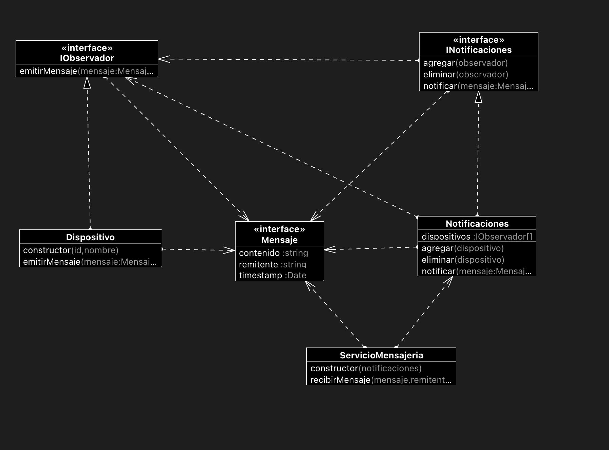
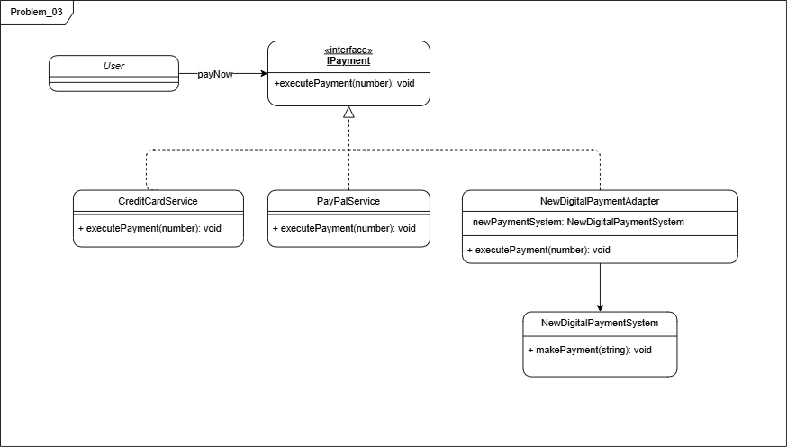
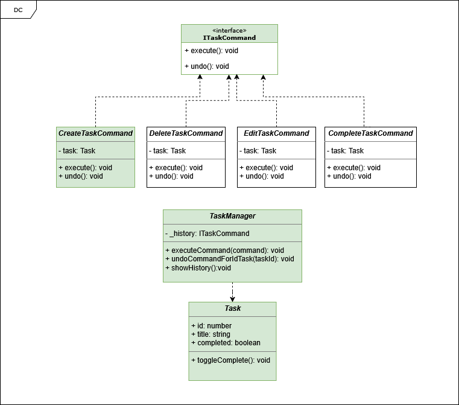

# Patrones_Diseno_TypeScript_U_Sabana

# Taller N°1

Repositorio creado para el aprendizaje de patrones de diseño en arquitectura de software

# Problema 1 ==> Clonación de Personajes en un Videojuego de Aventuras

# Problema 2 ==> Desarrollando de aplicación de mensajería

### Contexto:

La empresa está desarrollando una aplicación de mensajería en tiempo real que permite
a los usuarios comunicarse desde múltiples dispositivos. Cada vez que un usuario recibe un
nuevo mensaje, todos los dispositivos del usuario deben ser notificados para que el
mensaje se muestre en cada uno de ellos. Para mantener la flexibilidad y desacoplar la
lógica de notificación de la aplicación principal.
El patrón que escoja deberá permitir

### Aplicación del Patrón:

Para resolver el problema planteado, se ha seleccionado el patrón de diseño Observer, el cual permite establecer una relación de uno-a-muchos entre objetos. En este caso, la aplicación de mensajería actúa como el sujeto (publisher), y cada uno de los dispositivos del usuario funciona como un observador (subscriber).

Este patrón es ideal para escenarios en los que múltiples objetos deben ser notificados automáticamente cuando ocurre un cambio de estado, sin que el emisor de la notificación tenga que conocer los detalles de los receptores

Notificación en Tiempo Real:
Cada vez que un nuevo mensaje llega, el sistema notifica automáticamente a todos los dispositivos suscritos. Estos dispositivos, al estar escuchando como observadores, reciben el mensaje en tiempo real y lo muestran al usuario.

Desacoplamiento:
La aplicación de mensajería (sujeto) no necesita conocer los detalles específicos de los dispositivos (observadores). Solo emite el mensaje, y cada dispositivo suscrito se encarga de procesarlo según su lógica interna.

Flexibilidad:
Los dispositivos pueden añadirse o eliminarse dinámicamente durante la ejecución sin necesidad de modificar la lógica central. Esta capacidad permite escalar y adaptar el sistema a nuevos requerimientos de manera sencilla y mantenible.

### Diagrama de clases



### 🚀 Instrucciones para ejecutar el proyecto

1. Asegúrate de estar en la raíz del proyecto. Luego, ingresa a la carpeta del proyecto con:

   ```sh
   cd Patrones_Diseno/
   ```

2. Instala las dependencias ejecutando:

   ```sh
   npm install
   ```

3. Una vez completada la instalación, ejecuta el siguiente comando para correr el problema 03:
   ```sh
   npm run Problem_02
   ```

🎉 ¡Y listo! Ahora el problema 03 estará corriendo en tu máquina.

# Problema 3 💳 Integración de un Sistema de Pago Externo

### Contexto:

Imagina que estás desarrollando una plataforma de comercio electrónico y deseas ofrecer a tus clientes múltiples opciones de pago, incluyendo tarjetas de crédito, PayPal y un nuevo sistema de pago digital que acaba de ser lanzado. Sin embargo, este nuevo sistema de pago tiene una interfaz incompatible con tu plataforma existente, lo que dificulta su integración

### Aplicación del Patrón:

Para resolver este problema, aplicaremos el patrón de diseño Adapter, el cual permite que dos interfaces incompatibles trabajen juntas. En nuestro caso, simulamos que el nuevo sistema de pago implementa un método con una estructura diferente, lo que lo hace incompatible con el resto de las opciones de pago existentes.

Para solucionar esto, crearemos un adaptador que actuará como un wrapper, encapsulando la lógica necesaria para traducir la nueva implementación a una interfaz compatible con el sistema actual. De esta manera, garantizamos una integración fluida sin afectar el código existente.

Con este enfoque, logramos mayor flexibilidad y mantenibilidad en el sistema, facilitando la incorporación de futuras soluciones de pago sin alterar la lógica principal.

### Diagrama de clases



### 🚀 Instrucciones para ejecutar el proyecto

1. Asegúrate de estar en la raíz del proyecto. Luego, ingresa a la carpeta del proyecto con:

   ```sh
   cd Patrones_Diseno/
   ```

2. Instala las dependencias ejecutando:

   ```sh
   npm install
   ```

3. Una vez completada la instalación, ejecuta el siguiente comando para correr el problema 03:
   ```sh
   npm run Problem_03
   ```

🎉 ¡Y listo! Ahora el problema 03 estará corriendo en tu máquina.

# Problema 4 ==> Sistema de Gestión de Tareas

Contexto:

    Imagina un sistema de gestión de tareas en el que los usuarios pueden crear, editar, eliminar y completar tareas. Cada acción realizada por el usuario corresponde a una acción que debe ser ejecutada. Además, es importante mantener un registro de todas las acciones realizadas para permitir la reversión de las mismas si es necesario.

Aplicación del Patrón:

    En este escenario, el patrón será aplicado para encapsular cada una de las acciones que el usuario puede realizar sobre una tarea.
    El patrón que seleccione debe tener los siguientes beneficios:
        ● Desacopla el invocador de los objetos que realizan las acciones.
        ● Permite la extensión de nuevas operaciones sin modificar el código existente.
        ● Facilita el registro de acciones para realizar operaciones de reversión.

Análisis de SOLID en la Implementación

Esta implementación del gestor de tareas con el patrón Command sigue los principios SOLID, garantizando un código limpio, modular y escalable.

Principios SOLID Aplicados

    S - Principio de responsabilidad única (SRP)

        Cada clase tiene una única responsabilidad:

        Task → Representa una tarea.
        CreateTaskCommand, EditTaskCommand, DeleteTaskCommand, CompleteTaskCommand → Cada una encapsula una sola acción sobre una tarea.
        TaskManager → Se encarga solo de ejecutar y deshacer comandos.

    O - Principio de abierto/cerrado (OCP)

        Se pueden agregar nuevas operaciones sin modificar el código existente.

        Si mañana necesitamos un nuevo comando (AssignUserCommand, SetPriorityCommand), solo agregamos una nueva clase sin tocar las demás.
        TaskManager no necesita saber qué comandos existen, solo los ejecuta.

    L - Principio de sustitución de liskov (LSP)

        ITaskCommand define una interfaz clara (execute() y undo()), y todas las clases de comandos la implementan sin romper la funcionalidad.

    I - Principio de segregación de interfaces (ISP)

        ITaskCommand es una interfaz específica y simple, con solo los métodos que cada comando necesita (execute() y undo()).

    D - Principio de inversión de dependencias (DIP)

        TaskManager depende de una abstracción (ITaskCommand) en lugar de implementaciones concretas.
        Esto permite intercambiar comandos sin modificar TaskManager.

Diagrama de clases para la solución del problema 04



# Problema 5 ==> Decoración de Habitaciones en un Hotel

# Taller N°2

### Contexto:

El taller involucra la creación de microservicios individualmente desplegables, utilizando contenedores Docker, un orquestador de contenedores como Kubernetes y herramientas como Helm para la gestión de paquetes y configuraciones.
Pasos:
Trabaje con un microservicio básico .
Diseñar los contenedores Docker para el microservicio incluyendo la configuración necesaria.
Despliegue con Helm:
Crear charts de Helm el microservicio, especificando las dependencias y configuraciones necesarias.
Utilizar valores por defecto y overrides para personalizar las configuraciones según el entorno.

Implementación de ArgoCD:
Desplegar ArgoCD en el clúster de Kubernetes.
Configurar repositorios Git como fuentes de definición de la aplicación.
Definir aplicación en ArgoCD para el microservicio, utilizando los charts de Helm.

Automatización con Pipelines:
Cree los pipeline necesarios para desplegar el aplicativo en el momento de detectar un commit sobre la rama que configure, Configurando pipelines de CI/CD para automatizar el proceso de construcción y despliegue del microservicio.

Acá pondrá en práctica:
Docker
Kubernetes
Herramienta de CI que escoja
ArgoCD
Helm

Entregables: código fuente que se usó y video presentando el resultado

### Paso a paso de lo realizado:

# Manual de despliegue completo en Azure AKS + Helm + Ingress + ArgoCD + GitHub Actions

Este manual detalla paso a paso cómo desplegar una aplicación de microservicios en Azure utilizando un stack moderno basado en contenedores, automatización e infraestructura como código.

Tecnologías utilizadas:

- ✅ **Azure Kubernetes Service (AKS)**
- ✅ **Helm** para gestión de paquetes K8s
- ✅ **Ingress NGINX** para enrutamiento HTTP
- ✅ **Cert-Manager** para TLS automático
- ✅ **ArgoCD** para GitOps
- ✅ **GitHub Actions** para CI/CD

---

## Paso 1: Seleccionar la suscripción de Azure

az account set --subscription "<TuSuscripción>"

## Paso 2: Crear un grupo de recursos

az group create --name "<NombreGrupodeRecuso>" --location eastus

## Paso 3: Crear un clúster de AKS (bajo costo)

```
az aks create \
 --resource-group "<NombreGrupodeRecuso>" \
 --name "<NombreAKS>" \
 --node-count 1 \
 --node-vm-size Standard_B2s \
 --enable-managed-identity \
 --generate-ssh-keys \
 --location eastus
```

## Paso 4: Conectarse al clúster

az group create --name "<NombreGrupodeRecuso>" --location eastus

## Paso 5: Verificar el estado del clúster

kubectl get nodes

## Paso 6: Instalar Ingress NGINX

kubectl apply -f https://raw.githubusercontent.com/kubernetes/ingress-nginx/controller-v1.9.4/deploy/static/provider/cloud/deploy.yaml

## Paso 7: Verificar los pods de Ingress

kubectl get pods -n ingress-nginx

## Paso 8: Obtener la IP pública del Ingress

kubectl get svc ingress-nginx-controller -n ingress-nginx

- ✅ Importante: esa IP se usará en los hostnames .nip.io y en los archivos de Ingress y ArgoCD.

## Paso 9: Instalar Cert-Manager para certificados SSL

kubectl apply -f https://github.com/cert-manager/cert-manager/releases/download/v1.13.2/cert-manager.yaml
kubectl get pods -n cert-manager

## Paso 10: Crear archivo cluster-issuer.yaml

```
apiVersion: cert-manager.io/v1
kind: ClusterIssuer
metadata:
name: letsencrypt-prod
spec:
acme:
email: tu_email@correo.com
server: https://acme-v02.api.letsencrypt.org/directory
privateKeySecretRef:
name: letsencrypt-prod
solvers: - http01:
ingress:
class: nginx
```

kubectl apply -f cluster-issuer.yaml
kubectl get clusterissuer

## Paso 11: Crear archivo ingress-microservicio.yaml

```
apiVersion: networking.k8s.io/v1
kind: Ingress
metadata:
name: microservicio-ingress
annotations:
cert-manager.io/cluster-issuer: "letsencrypt-prod"
nginx.ingress.kubernetes.io/rewrite-target: /
spec:
ingressClassName: nginx
tls:

- hosts:
  - microservicio.<IP>.nip.io
    secretName: microservicio-tls
    rules:
- host: microservicio.<IP>.nip.io
  http:
  paths:
  - path: /
    pathType: Prefix
    backend:
    service:
    name: microservice-app-helm
    port:
    number: 80
```

kubectl apply -f ingress-microservicio.yaml
kubectl get ingress
kubectl describe certificate microservicio-tls

## Paso 12: Instalar ArgoCD

kubectl create namespace argocd
kubectl apply -n argocd -f https://raw.githubusercontent.com/argoproj/argo-cd/stable/manifests/install.yaml
kubectl get pods -n argocd

## Paso 13: Crear archivo argocd-ingress.yaml

```
apiVersion: networking.k8s.io/v1
kind: Ingress
metadata:
name: argocd-ingress
namespace: argocd
annotations:
nginx.ingress.kubernetes.io/backend-protocol: "HTTPS"
nginx.ingress.kubernetes.io/ssl-redirect: "true"
spec:
ingressClassName: nginx
rules:

- host: argocd.<IP>.nip.io
  http:
  paths:
  - path: /
    pathType: Prefix
    backend:
    service:
    name: argocd-server
    port:
    number: 443
```

kubectl apply -f argocd-ingress.yaml

## Paso 14: Obtener contraseña de ArgoCD

kubectl get secret argocd-initial-admin-secret -n argocd -o yaml

el valor del password decodificarlo en base64

## Paso 15: Configurar GitHub Actions (CI/CD)

Crear Archivo: .github/workflows/deploy.yml

## Paso 16: Secretos requeridos en GitHub

GH_PAT Token personal con permiso push
DOCKER_USERNAME Usuario Docker Hub
DOCKER_PASSWORD Token o contraseña de Docker Hub

## Paso 17: Crear el Chart

Desde la raíz del proyecto o carpeta del microservicio:

```bash
helm create helm
```

Esto genera la siguiente estructura

```
helm/
├── charts/
├── templates/
│ ├── deployment.yaml
│ ├── service.yaml
│ ├── ingress.yaml
│ ├── hpa.yaml
│ ├── serviceaccount.yaml
│ ├── tests/
├── Chart.yaml
├── values.yaml
```

## Paso 18: Editar el Chart.yaml

apiVersion: v2
name: helm
description: A Helm chart for Kubernetes
type: application
version: 0.1.0
appVersion: "1.16.0"

## Paso 19: Configurar values.yaml

```
replicaCount: 2

image:
repository: # valores de usuarioImagen/nombreImagen
pullPolicy: Always
tag: latest # Este valor es actualizado automáticamente por GitHub Actions

service:
type: ClusterIP
port: 80

containerPort: 3000

resources:
requests:
cpu: 100m
memory: 128Mi
limits:
cpu: 200m
memory: 256Mi

ingress:
enabled: false
className: ''
annotations: {}
hosts: - host: chart-example.local
paths: - path: /
pathType: ImplementationSpecific
tls: []

autoscaling:
enabled: false
minReplicas: 1
maxReplicas: 100
targetCPUUtilizationPercentage: 80
targetMemoryUtilizationPercentage: 80
```

Este archivo es actualizado por GitHub Actions cada vez que se hace push a la rama develop

## Resultado final

Infraestructura en Azure lista
HTTPS automático con Let's Encrypt
ArgoCD desplegando desde Git
CI/CD conectado con GitHub Actions
Push a develop = Deploy automático en AKS

URL MicroServicio: https://microservicio.51.8.47.204.nip.io/health
URL Argo: https://argocd.51.8.47.204.nip.io

## 🧑‍💻 Autores

Este proyecto fue desarrollado por:

| Nombre             | GitHub                                                         |
| ------------------ | -------------------------------------------------------------- |
| Camilo Navarrete   | [@CamiloN03](https://github.com/CamiloN03)                     |
| Cristian Melgarejo | [@CristianMelgarejo94](https://github.com/CristianMelgarejo94) |
| Vanessa Morales    | [@ness918](https://github.com/ness918)                         |
| [Nombre]           | [@TuGitHub](https://github.com/TuGitHub)                       |
| [Nombre]           | [@TuGitHub](https://github.com/TuGitHub)                       |
